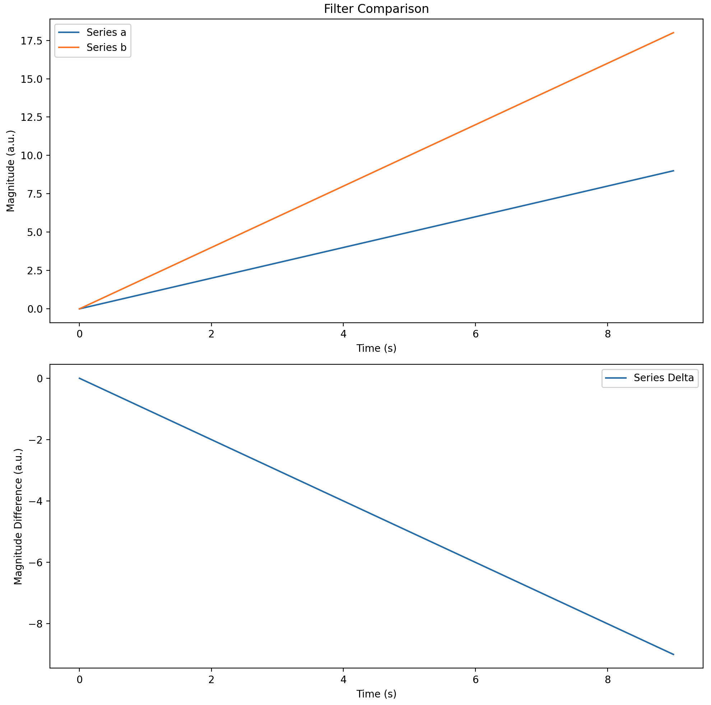

[](https://github.com/qsib-cbie/sci-rs/actions/workflows/rust.yml)
[](https://crates.io/crates/sci-rs)
[](https://crates.io/crates/sci-rs)

# sci-rs

Rust implementation of scientfic processing routines, dominantly mirroring SciPy. Implemented for the intent of use on embedded `no_std` + alloc, mobile (iOS), and server for translation of post-processed academic research to portable, real-time deployment.


Memory usage is a priority. While `alloc` is a default feature, the library will prefer implementations that do not require runtime allocations. Allocating functions use the `*_dyn` convention, and Non-allocating functions use the `*_st` convention.

## Features

* stats
  * mean, median, mode, variance, standard deviation, auto correlation
* IIR filter design
  * ba, zpk, or sos format
  * Butterworth
    * lowpass, highpass, bandpass, bandstop
* IIR sosfilt, sosfiltfilt
* GH, GHK filtering (alpha-beta, alpha-beta-gamma)
* Kalman filtering
* Gaussian filter design and filtering
* Savitsky-Golay design and filtering
* Resampling (using Fourier-method)


Butterworth (low/high/band)pass filter design to SOS or BA. SOS filtering with sosfilt and sosfiltfilt. Statistics like standard deviation or median.

```rust
use sci_rs::signal::filter::{design::*, sosfiltfilt_dyn};

// MATLAB style function to generate Section order Section
pub fn butter_filter_lowpass<F>(order: usize, lowcut: F, fs: F) -> Vec<Sos<F>>
where
    F: Float + RealField + Sum,
{
    // Design Second Order Section (SOS) filter
    let filter = butter_dyn(
        order,
        [lowcut].to_vec(),
        Some(FilterBandType::Lowpass),
        Some(false),
        Some(FilterOutputType::Sos),
        Some(fs),
    );
    let DigitalFilter::Sos(SosFormatFilter {sos}) = filter else {
        panic!("Failed to design filter");
    };
    sos
}

// Or call iirfilter directly to design
let filter = iirfilter_dyn::<f32>(
    4,
    vec![10., 50.],
    None,
    None,
    Some(FilterBandType::Bandpass),
    Some(FilterType::Butterworth),
    Some(false),
    Some(FilterOutputType::Sos),
    Some(1666.),
);
let DigitalFilter::Sos(sos) = filter else { panic!("Not SOS filter") };
let data = (0..100000).map(|i| i as f32);
let filtered: Vec<f32> = sosfiltfilt_dyn(data, &sos.sos);
```

## Tests pass according to SciPy

For correctness, tests use hardcoded magic numbers from scipy. At the moment, this requires manual scripting and testing. A local python virtualenv is recommended for development of this crate.

## Contributing

Please compare your changes for correctness against SciPy if implementing or correcting a new feature.

Generating plots and adding plots to PRs can help accelerate debugging and approval.

Here is a quick plotting script

```python
import matplotlib.pyplot as plt
import matplotlib.gridspec as gridspec
import numpy as np

# Some data from scipy
a = np.arange(10)
# Some data from sci-rs
b = np.arange(10) * 2

# A plot with two rows
fig = plt.figure(figsize=(10, 10))
gs = gridspec.GridSpec(2, 1)
ax = fig.add_subplot(gs[0, 0])

# A plot with titles and labels
ax.plot(a, label="Series a")
ax.plot(b, label="Series b")
ax.set_title('Filter Comparison')
ax.set_ylabel('Magnitude (a.u.)')
ax.set_xlabel('Time (s)')
ax.legend()

# Another plot with titles and labels using the same axis
ax = fig.add_subplot(gs[1, 0], sharex=ax)
ax.plot(a - b, label = "Series Delta")
ax.set_ylabel('Magnitude Difference (a.u.)')
ax.set_xlabel('Time (s)')
ax.legend()

# Manually inspect the data and grab screenshot
plt.tight_layout()
plt.show()
```



## MSRV

Until the project matures, we will aim to support the most recent stable version of Rust.

Some unstable features like `const-generic-exprs` would enable more non-allocating support but are unreliable. https://github.com/rust-lang/rust/issues/106423 has been broken on nightly for over a year.

Unstable feature usage with `*_st` interface is removed until further notice.

## Future Goals

### Python :: Be able to replace scipy with sciprs

Here is an example of python that uses sosfiltfilt to bandpass a numpy array

```python
import numpy as np
# from scipy.signal import butter, sosfiltfilt
from sciprs.signal import butter, sosfiltfilt

raw = np.array([0.0, 0.09414586007215595, 0.18745540640340155, ...])
sos = butter(4, [10, 50], btype='bandpass', output='sos', fs=1666)
np_ndarray_filtered_by_rust_code = sosfiltfilt(buttersos, raw, 0)
```


#### Rust :: Copy paste python with macros

In order to minimize friction from using scipy python code directly in rust, sci-rs will include a macro system for python-compatible syntax to expand the sci-rs side logic that is currently interacting with pyo3 and the local python runtime. The following doesn't exist but provides a vision for the future compatibility.

```rust
let filtered_data: nalgebra::DVector<f64> = sciprs! {
    raw = np.array([0.0, 0.09414586007215595, 0.18745540640340155, 0.27909975437050305, 0.3682648115914595])
    sos = butter(4, [10, 50], btype='bandpass', output='sos', fs=1666)
    sosfiltfilt(sos, raw, 0)
};
```

### System Linear Algebra Dependency

I haven't decided if we will be primarily using ndarray or nalgebra. Either abstraction going back to python can be converted to a numpy ndarray with the python runtime. Between the two crates, one of the primary reasons for creating `sci-rs` is to support targets that may not have reasonable access to LAPACK or blas. The choice of library will be determined on feature compatibility rather than performance. That said, there will be many instances where the performance is great, and there will be benchmarks.

ndarray and nalgebra both have features related to matrixmultiply and lapack. Nalgebra has the benefit of being very usable in `no_std`.

Iterator and slice patterns are used where possible for better compatibility. In the future, rayon may be on the radar for parallelizing compute.


### Maturin + Scipy + Sciprs + Numpy + Matplotlib

Once a method is implemented locally, your local `sciprs` crate can point to its dependency at your local `sci-rs` directory `sci-rs = { path = "../sci-rs" }`. You can `maturin develop` to build and install changes made in Rust and script comparisons directly through python.

```
(sciprs-env) jwtrueb@macbook-pro sciprs % maturin develop --release
🔗 Found pyo3 bindings
🐍 Found CPython 3.9 at /Users/jwtrueb/Desktop/workspace/sciprs/sciprs-env/bin/python
   Compiling autocfg v1.1.0
   Compiling target-lexicon v0.12.4
...
   Compiling nalgebra v0.31.1
   Compiling numpy v0.16.2
   Compiling sci-rs v0.1.2 (/Users/jwtrueb/Desktop/workspace/sci-rs/sci-rs)
   Compiling nalgebra-numpy v0.3.0 (https://github.com/qsib-cbie/nalgebra-numpy#427a8135)
   Compiling sciprs v0.1.0 (/Users/jwtrueb/Desktop/workspace/sciprs)
    Finished release [optimized] target(s) in 12.10s
📦 Built wheel for CPython 3.9 to /var/folders/n_/s24_t4gj6rnf7r2kxj376df40000gn/T/.tmphMfGAv/sciprs-0.1.0-cp39-cp39-macosx_11_0_arm64.whl
```

importlib.reload doesn't work, so you need to relaunch the interpreter each time.

```python
# load the module with the new Rust code
import sciprs

# do what you want
print(sciprs.call_new_function(1,2,3))
```


